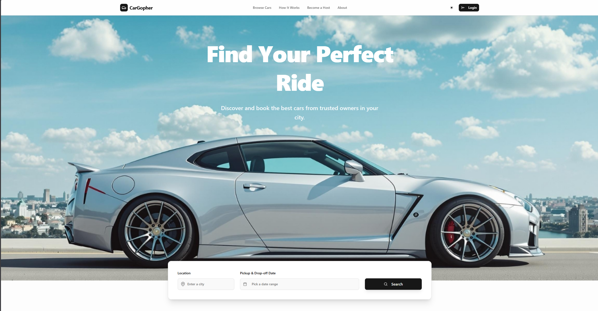

# 🚗 CarGopher - Premium Car Rental Platform

A modern, full-stack car rental platform built with Next.js 15, Supabase, and TypeScript. CarGopher connects car owners with customers, providing a seamless experience for renting premium vehicles.



## 🌟 Demo

🔗 **Live Demo**: [https://cargopher.vercel.app/]

## ✨ Features

### 🏠 **Core Functionality**
- **Dual-Mode Interface**: Light/Dark theme support with smooth transitions
- **Multi-Role System**: Customer and Car Owner dashboards
- **Real-time Booking Management**: Live booking status updates
- **Advanced Search & Filtering**: Location-based search with multiple filters
- **Wishlist System**: Save favorite cars for later
- **Review & Rating System**: Customer feedback and ratings
- **Google Maps Integration**: Location visualization and search
- **Responsive Design**: Mobile-first approach with modern UI

### 👥 **User Roles**

#### 🛍️ **Customers**
- Browse and search available cars
- Filter by brand, model, price, location
- Book cars with date selection
- Manage bookings (view, cancel)
- Add cars to wishlist
- Leave reviews and ratings
- Profile management with avatar upload

#### 🏪 **Car Owners**
- List and manage car inventory
- Upload multiple car images
- Set pricing and availability
- Manage booking requests (approve/reject)
- View earnings and statistics
- Track car performance metrics
- Owner dashboard with analytics

## 🛠️ Tech Stack

- **Frontend**: Next.js 15, React 19, TypeScript
- **Backend**: Next.js API Routes, Supabase
- **Database**: PostgreSQL (Supabase)
- **Authentication**: Supabase Auth
- **Storage**: Supabase Storage (Car Images, Avatars)
- **Styling**: Tailwind CSS, Shadcn/ui Components
- **Maps**: Google Maps API
- **Forms**: React Hook Form, Zod Validation
- **State Management**: Zustand, SWR
- **Icons**: Lucide React
- **Notifications**: Sonner Toast

## 📁 Project Structure

```
car_rental/
├── app/                          # Next.js App Router
│   ├── api/                      # API Routes
│   │   ├── auth/                 # Authentication endpoints
│   │   ├── cars/                 # Car management endpoints
│   │   ├── bookings/             # Booking management endpoints
│   │   ├── owner/                # Owner-specific endpoints
│   │   ├── profile/              # User profile endpoints
│   │   ├── reviews/              # Review system endpoints
│   │   └── wishlist/             # Wishlist endpoints
│   ├── auth/                     # Authentication pages
│   ├── cars/                     # Car listing & details pages
│   ├── dashboard/                # Customer dashboard
│   ├── owner/                    # Owner dashboard & management
│   └── globals.css              # Global styles
├── components/                   # Reusable React components
│   ├── auth/                     # Authentication components
│   ├── booking/                  # Booking-related components
│   ├── cars/                     # Car display components
│   ├── dashboard/                # Dashboard components
│   ├── home/                     # Homepage components
│   ├── layout/                   # Layout components
│   ├── maps/                     # Google Maps components
│   ├── owner/                    # Owner dashboard components
│   ├── shared/                   # Shared utility components
│   ├── ui/                       # Shadcn/ui components
│   └── wishlist/                 # Wishlist components
├── hooks/                        # Custom React hooks
├── lib/                          # Utility libraries
│   ├── booking/                  # Booking validation logic
│   ├── config/                   # Configuration files
│   ├── context/                  # React context providers
│   ├── supabase/                 # Supabase client configuration
│   ├── types/                    # TypeScript type definitions
│   ├── utils/                    # Utility functions
│   └── validation/               # Zod validation schemas
└── public/                       # Static assets
```

## 🔌 API Endpoints

### 🔐 **Authentication**
- `POST /api/auth/login` - User login
- `POST /api/auth/signup` - User registration
- `POST /api/auth/logout` - User logout
- `GET /api/auth/user` - Get current user

### 🚗 **Cars**
- `GET /api/cars` - List cars with filters and pagination
- `GET /api/cars/[id]` - Get car details
- `GET /api/owner/cars` - Get owner's cars
- `POST /api/owner/cars` - Create new car listing
- `PUT /api/owner/cars/[id]` - Update car details
- `DELETE /api/owner/cars/[id]` - Delete car listing

### 📅 **Bookings**
- `POST /api/bookings` - Create new booking
- `GET /api/bookings/my-bookings` - Get customer bookings
- `GET /api/owner/bookings` - Get owner's bookings
- `POST /api/bookings/[id]/confirm` - Confirm booking (owner)
- `POST /api/bookings/[id]/reject` - Reject booking (owner)
- `POST /api/bookings/[id]/cancel` - Cancel booking (customer)

### ⭐ **Reviews**
- `POST /api/reviews` - Create review
- `GET /api/reviews/[carId]` - Get car reviews

### 💝 **Wishlist**
- `POST /api/wishlist/[carId]` - Toggle wishlist item
- `GET /api/wishlist` - Get user's wishlist

### 👤 **Profile**
- `GET /api/profile` - Get user profile
- `PUT /api/profile` - Update user profile
- `POST /api/profile/avatar` - Upload profile avatar

### 📊 **Owner Dashboard**
- `GET /api/owner/dashboard-stats` - Get owner analytics

## 📱 Pages & Routes

### 🌐 **Public Pages**
- `/` - Homepage with hero section and featured cars
- `/cars` - Car listings with search and filters
- `/cars/[id]` - Individual car details and booking
- `/auth/login` - User login page
- `/auth/signup` - User registration page

### 👤 **Customer Dashboard** (`/dashboard`)
- `/dashboard` - Customer overview
- `/dashboard/bookings` - Booking management
- `/dashboard/wishlist` - Saved cars
- `/dashboard/profile` - Profile settings

### 🏪 **Owner Dashboard** (`/owner`)
- `/owner/dashboard` - Owner analytics and overview
- `/owner/cars` - Car inventory management
- `/owner/cars/new` - Add new car listing
- `/owner/cars/edit/[id]` - Edit car details
- `/owner/bookings` - Booking requests management
- `/owner/profile` - Owner profile settings

## 🚀 Getting Started

### 📋 **Prerequisites**

- Node.js 18+ 
- npm, yarn, or pnpm
- Supabase account
- Google Maps API key

### 🔧 **Installation**

1. **Clone the repository**
   ```bash
   git clone https://github.com/yourusername/car_rental.git
   cd car_rental
   ```

2. **Install dependencies**
   ```bash
   npm install
   # or
   yarn install
   # or
   pnpm install
   ```

3. **Environment Setup**

   Create a `.env.local` file in the root directory:

   ```env
   # Supabase Configuration
   NEXT_PUBLIC_SUPABASE_URL=your_supabase_project_url
   NEXT_PUBLIC_SUPABASE_ANON_KEY=your_supabase_anon_key
   SUPABASE_SERVICE_ROLE_KEY=your_supabase_service_role_key

   # Google Maps API
   NEXT_PUBLIC_GOOGLE_MAPS_API_KEY=your_google_maps_api_key

   # App Configuration
   NEXT_PUBLIC_APP_URL=http://localhost:3000
   ```

4. **Run the development server**
   ```bash
   npm run dev
   # or
   yarn dev
   # or
   pnpm dev
   ```

5. **Open your browser**
   Navigate to [http://localhost:3000](http://localhost:3000)

### 🏗️ **Build for Production**

```bash
npm run build
npm run start
```

## 🔑 **Environment Variables**

| Variable | Description | Required |
|----------|-------------|----------|
| `NEXT_PUBLIC_SUPABASE_URL` | Supabase project URL | ✅ |
| `NEXT_PUBLIC_SUPABASE_ANON_KEY` | Supabase anonymous key | ✅ |
| `SUPABASE_SERVICE_ROLE_KEY` | Supabase service role key | ✅ |
| `NEXT_PUBLIC_GOOGLE_MAPS_API_KEY` | Google Maps API key | ✅ |
| `NEXT_PUBLIC_APP_URL` | Application base URL | ✅ |

## 🗃️ **Database Schema**

### Core Tables:
- **profiles** - User profiles (customers & owners)
- **cars** - Car listings and details
- **bookings** - Rental bookings and status
- **reviews** - Customer reviews and ratings
- **wishlists** - Customer saved cars

### Storage Buckets:
- **car-images** - Car listing photos
- **avatars** - User profile pictures

## 🔒 **Authentication & Authorization**

- **Row Level Security (RLS)** enabled on all tables
- **Role-based access control** (Customer/Owner)
- **JWT-based authentication** via Supabase Auth
- **Protected routes** with middleware validation
- **API endpoint protection** with role verification

## 🎨 **UI/UX Features**

- **Modern Design System** using Shadcn/ui components
- **Dark/Light Mode** with system preference detection
- **Responsive Layout** optimized for all devices
- **Loading States** and error handling
- **Toast Notifications** for user feedback
- **Smooth Animations** and transitions
- **Accessibility** features built-in

## 📊 **Key Features in Detail**

### 🔍 **Advanced Search**
- Location-based search with Google Places
- Multiple filter options (brand, model, price, type)
- Real-time search results
- Pagination and sorting

### 📅 **Booking System**
- Date range picker with availability checking
- Conflict prevention and validation
- Real-time price calculation
- Booking status management (pending, confirmed, rejected, cancelled)

### ⭐ **Review System**
- Post-booking review capability
- Star rating system (1-5 stars)
- Review aggregation and statistics
- Review display with customer details

### 📸 **Image Management**
- Multiple image upload for car listings
- Image optimization and compression
- Secure storage with Supabase Storage
- Responsive image display

---

Built with ❤️ using Next.js 15 and Supabase
